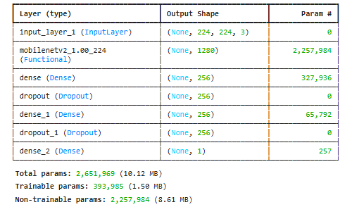
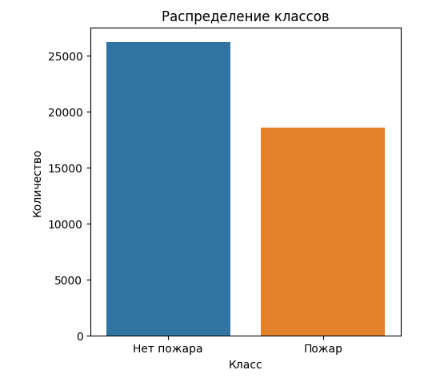
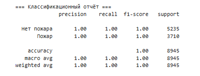
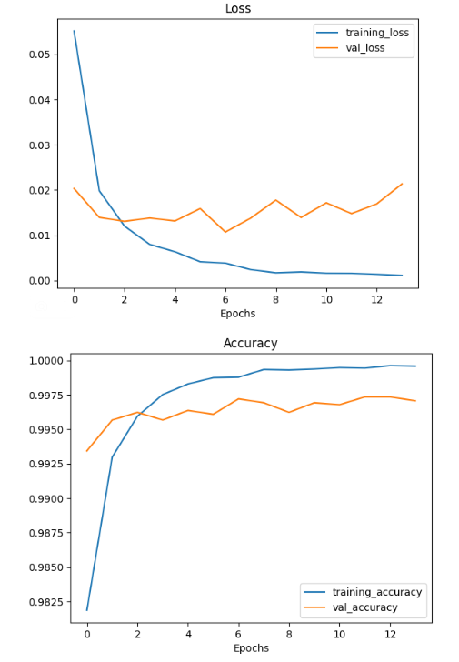
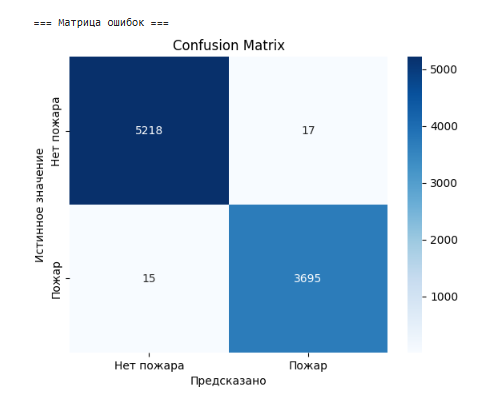
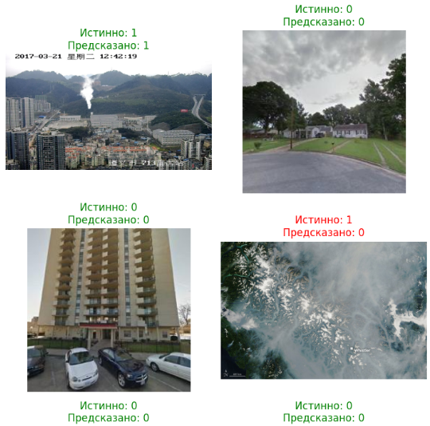

# FireAlarmNet_Project
## Система выявления пожаров по фото

[Ноутбук с проектом](ds-final-rpoject-detection.ipynb)   
[Веса модели](fire_detector.weights.h5)   
  
### Описание проекта
Проект представляет собой систему автоматического обнаружения пожаров на изображениях с помощью современных методов глубокого обучения. Проект позволяет классифицировать фотографии на две категории: «Пожар» и «Нет пожара» в зависимости от сожержимого фотографии, что может быть использовано для мониторинга, предупреждения и реагирования на возгорания в различных сферах.  

### Источник данных для обучения
Для обучения модели использовались следующие открытые датасеты с платформы Kaggle:  
| Название датасета | Описние | Ссылка |
|-------------|-------------|-------------|
| Forest Fire | Фотографии пожаров и дыма в лесах | [Датасет](https://www.kaggle.com/datasets/kutaykutlu/forest-fire?select=train_fire) |
| FIRE Dataset | Фотографии с открытым огнем, а также без него | [Датасет](https://www.kaggle.com/datasets/phylake1337/fire-dataset) |
| Fire Detection Dataset | Фотографии с открытым огнем, а также без него | [Датасет](https://www.kaggle.com/datasets/atulyakumar98/test-dataset) |
| Fire and Smoke dataset | Фотографии с огнем или дымом, а также без них | [Датасет](https://www.kaggle.com/datasets/ashutosh69/fire-and-smoke-dataset) |
| House Rooms & Streets Image Dataset | Фотографии улиц и комнат без дыма и огня | [Датасет](https://www.kaggle.com/datasets/mikhailma/house-rooms-streets-image-dataset) |  

Общее количество изображений: train: 35 778, test: 8 945

### Описание архитектуры модели обучения  
В основе решения лежит сверточная нейронная сеть с использованием предобученной архитектуры MobileNetV2 (transfer learning).  
К базовой модели добавлен классификатор из полносвязных слоёв с функцией активации ReLU и Dropout для предотвращения переобучения.  
Финальный слой использует сигмоидальную активацию для бинарной классификации.  
Базовая часть модели заморожена для ускорения и стабилизации обучения, обучение ведётся только на верхних слоях классификатора.  

  

### Достигнутые результаты  

#### Баланс классов
Сводный датасет содержит оба класса («Пожар» и «Нет пожара») в достаточном количестве, что позволяет избежать сильного дисбаланса. Нет необходимости в дополнительной балансировке 

  

#### Точность и метрики  
- Итоговая точность на валидации и тесте равна ~99.7%
- Precision, Recall, F1-score для обоих классов равны 1.00 (по отчёту классификации)

   
  
#### Процесс обучения  
- Графики потерь и точности показывают быстрое сходимое обучение без явного переобучения
- Использована ранняя остановка для выбора оптимальной эпохи

   

  
#### Качество предсказаний  
- Матрица ошибок показывает минимальное количество ложных срабатываний и пропусков
- Визуализация примеров демонстрирует уверенное распознавание изображений обоих классов  
  
   

Отдельно видно на демонстрации работы модели, что редкие ошибки характерны скорее для изображений, которые выбиваются из логики базовых датасетов. Так модель восприняла облака со спутникового снимка за дым, и они действительно на него похожи. Судя по описанию датасетов, имеет место скорее всего ошибка в загрузке этого изображения в один из датасетов. Так что даже эта ошибка является весьмы условной. Общее качество работы модели тем временем является впечатляющим.  

   

#### Выводы и примеры потенциальных кейсов для применения этой или аналогичных моделей 
Обучение удалось — метрики качества очень высокие. Фактическое качество 99% точности. Процесс обучения был достаточно быстр: на Kaggle с использованием GPU T2 x2 заняло около часа.  

Примеры и кейсы применения:
1. **Бизнес**:  
Интеграция в системы видеонаблюдения торговых центров, складов, промышленных объектов для автоматического обнаружения возгораний.  
Использование в облачных сервисах для мониторинга безопасности на объектах недвижимости.
  
2. **Государственные органы**:  
Внедрение в системы городского видеонаблюдения для быстрого реагирования на пожары в общественных местах (метро, вокзалы, аэропорты).  
Поддержка экологических и лесоохранных служб для мониторинга лесных массивов и раннего выявления лесных пожаров.  
  
3. **Противопожарные службы**:  
Автоматизация обработки поступающих с камер изображений и мгновенное оповещение дежурных о признаках возгорания.  
Анализ архивных данных для выявления зон повышенного риска и планирования профилактических мероприятий.  
  
4. **Охрана и безопасность**:  
Использование в системах «умного дома» для обнаружения пожаров на балконах, в гаражах, на дачных участках.  
Встраивание в мобильные приложения для мониторинга состояния удалённых объектов (например, дач, складов, гаражей).
